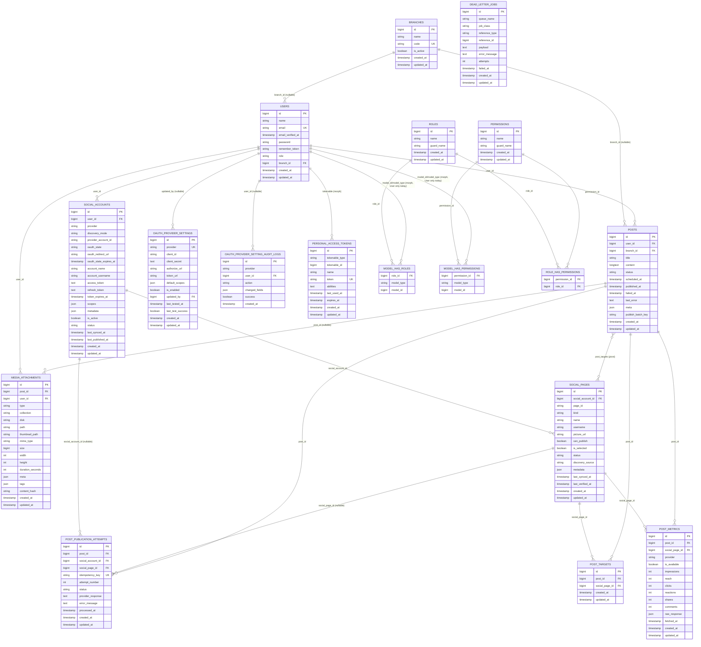

# Database Design (ERD)

> Rebuilt from scratch on 2026-07-27 by reading every migration in
> `smart_publisher_backend/database/migrations/` (25 files) and every model in
> `smart_publisher_backend/app/Models/` (12 files). This document contains
> **only** tables, columns, and relationships that are proven to exist in the
> migrations today. Nothing here is aspirational. See "Corrections from the
> previous (fictional) ERD" at the bottom for what was removed/added relative
> to the prior version of this file.

## Entity-Relationship Diagram

Notes on the diagram:
- `POSTS }o--o{ SOCIAL_PAGES` is realized through the `post_targets` pivot
  table (`Post::socialPages()` is a `belongsToMany(SocialPage::class,
  'post_targets')`).
- `model_has_roles` / `model_has_permissions` are Spatie's standard
  polymorphic pivots (`model_type` + `model_id`). Only `User` uses `HasRoles`
  today, so in practice `model_type` is always `App\Models\User`, but the
  columns are polymorphic and unconstrained by a table-specific FK on the
  morph side.
- `dead_letter_jobs.reference_type` / `reference_id` are a polymorphic pair
  with **no** database foreign key and **no** `morphTo()` relation defined on
  the `DeadLetterJob` model — they are plain informational columns, so no
  edge is drawn for them.
- `sessions.user_id` is declared with `foreignId('user_id')->nullable()->index()`
  but **without** `->constrained()` — i.e. it looks like a foreign key by
  naming convention only; there is no actual DB-level FK constraint on
  `sessions`.
- `personal_access_tokens.tokenable_*` is a polymorphic morph (Sanctum
  default); in this codebase the only tokenable model is `User`.

## Per-Table Reference

### users
Migration: `0001_01_01_000000_create_users_table.php`, altered by
`2026_07_20_000001_add_role_to_users_table.php` and
`2026_07_20_000004_add_branch_id_to_users_table.php`.

| Column | Type | Nullable | Default | Cast | Indexed/Unique |
|---|---|---|---|---|---|
| id | bigint | no | — | — | PK |
| name | string | no | — | — | |
| email | string | no | — | — | unique |
| email_verified_at | timestamp | yes | null | `datetime` | |
| password | string | no | — | `hashed` | |
| remember_token | string(100) | yes | null | — | |
| role | string | no | `'user'` | — | |
| branch_id | bigint (FK -> branches.id) | yes | null | — | `nullOnDelete` |
| created_at / updated_at | timestamp | yes | — | — | |

Model (`App\Models\User`): `belongsTo(Branch)`, `hasMany(SocialAccount)`,
`hasMany(Post)`, `hasMany(MediaAttachment)`. Uses Spatie's `HasRoles` trait
(guard `sanctum`) and Sanctum's `HasApiTokens`.

### branches
Migration: `2026_07_20_000003_create_branches_table.php`.

| Column | Type | Nullable | Default | Cast | Indexed/Unique |
|---|---|---|---|---|---|
| id | bigint | no | — | — | PK |
| name | string | no | — | — | |
| code | string | no | — | — | unique |
| is_active | boolean | no | `true` | `boolean` | |
| created_at / updated_at | timestamp | yes | — | — | |

Model (`App\Models\Branch`): `hasMany(User)`, `hasMany(Post)`.
This is the real tenant/scoping concept — there is **no** `organizations` or
`workspaces` table.

### social_accounts
Migration: `2026_07_20_000006_create_social_accounts_table.php`, altered by
`2026_07_20_000007_add_oauth_state_to_social_accounts_table.php`,
`2026_07_25_000003_add_discovery_mode_to_social_accounts_table.php`,
`2026_07_26_000005_add_last_published_at_to_social_accounts_table.php`.

| Column | Type | Nullable | Default | Cast | Indexed/Unique |
|---|---|---|---|---|---|
| id | bigint | no | — | — | PK |
| user_id | bigint (FK -> users.id) | no | — | — | `cascadeOnDelete`; part of index (user_id, provider) |
| provider | string | no | — | — | part of index (user_id, provider) |
| discovery_mode | string | no | `'manual'` | — | (backfilled to `'auto'` for facebook/instagram rows) |
| provider_account_id | string | no | — | — | unique with `provider` |
| oauth_state | string | yes | null | — | indexed |
| oauth_redirect_url | string | yes | null | — | |
| oauth_state_expires_at | timestamp | yes | null | `datetime` | |
| account_name | string | yes | null | — | |
| account_username | string | yes | null | — | |
| access_token | text | yes | null | `encrypted` | |
| refresh_token | text | yes | null | `encrypted` | |
| token_expires_at | timestamp | yes | null | `datetime` | |
| scopes | json | yes | null | `array` | |
| metadata | json | yes | null | `array` | |
| is_active | boolean | no | `true` | `boolean` | part of index (status, is_active) |
| status | string | no | `'connected'` | — | part of index (status, is_active) |
| last_synced_at | timestamp | yes | null | `datetime` | |
| last_published_at | timestamp | yes | null | `datetime` | |
| created_at / updated_at | timestamp | yes | — | — | |

Unique: `(provider, provider_account_id)`. Indexes: `(user_id, provider)`,
`(status, is_active)`, `oauth_state`.

Model (`App\Models\SocialAccount`): `belongsTo(User)`,
`hasMany(PostPublicationAttempt)`, `hasMany(SocialPage, 'pages')`. Helper
methods: `isTokenExpired()`, `hasRefreshToken()`, `isAutoDiscovery()`.

### social_pages
Migration: `2026_07_25_000001_create_social_pages_table.php`.

| Column | Type | Nullable | Default | Cast | Indexed/Unique |
|---|---|---|---|---|---|
| id | bigint | no | — | — | PK |
| social_account_id | bigint (FK -> social_accounts.id) | no | — | — | `cascadeOnDelete`; unique with page_id; part of index (social_account_id, is_selected) |
| page_id | string | no | — | — | unique with social_account_id |
| kind | string | no | `'page'` | — | |
| name | string | yes | null | — | |
| username | string | yes | null | — | |
| picture_url | string | yes | null | — | |
| can_publish | boolean | no | `true` | `boolean` | |
| is_selected | boolean | no | `false` | `boolean` | part of index (social_account_id, is_selected) |
| status | string | no | `'valid'` | — | indexed |
| discovery_source | string | no | `'auto'` | — | |
| metadata | json | yes | null | `array` | |
| last_synced_at | timestamp | yes | null | `datetime` | |
| last_verified_at | timestamp | yes | null | `datetime` | |
| created_at / updated_at | timestamp | yes | — | — | |

Unique: `(social_account_id, page_id)`. Indexes:
`(social_account_id, is_selected)`, `status`.

Model (`App\Models\SocialPage`): `belongsTo(SocialAccount)`,
`hasMany(PostTarget)`. `isUsable()` returns `can_publish && status === 'valid'`.

### posts
Migration: `2026_07_20_000008_create_posts_table.php`, altered by
`2026_07_20_000012_add_publish_batch_key_to_posts_table.php`.

| Column | Type | Nullable | Default | Cast | Indexed/Unique |
|---|---|---|---|---|---|
| id | bigint | no | — | — | PK |
| user_id | bigint (FK -> users.id) | no | — | — | `cascadeOnDelete`; part of index (user_id, status) |
| branch_id | bigint (FK -> branches.id) | yes | null | — | `nullOnDelete` |
| title | string | no | — | — | |
| content | longtext | yes | null | — | |
| status | string | no | `'draft'` | — | part of index (user_id, status) and (status, scheduled_at) |
| scheduled_at | timestamp | yes | null | `datetime` | part of index (status, scheduled_at) |
| published_at | timestamp | yes | null | `datetime` | indexed |
| failed_at | timestamp | yes | null | `datetime` | |
| last_error | text | yes | null | — | |
| meta | json | yes | null | `array` | |
| publish_batch_key | string | yes | null | — | indexed |
| created_at / updated_at | timestamp | yes | — | — | |

Indexes: `(user_id, status)`, `(status, scheduled_at)`, `published_at`,
`publish_batch_key`.

Model (`App\Models\Post`): `belongsTo(User)`, `belongsTo(Branch)`,
`hasMany(MediaAttachment)`, `hasMany(PostPublicationAttempt)`,
`hasMany(PostTarget, 'targets')`, `hasMany(PostMetric, 'metrics')`, and
`belongsToMany(SocialPage, 'post_targets')` via `socialPages()`.

**Status/lifecycle columns** (item 3): `status` (free-text state, default
`'draft'`; observed values driven by app logic — e.g. draft/scheduled/
publishing/published/failed), `scheduled_at` (when a scheduled post should
fire), `published_at` (when it actually went out), `failed_at` (when it last
failed), `last_error` (human-readable last failure message), and
`publish_batch_key` (groups posts published together in one batch/run, added
later specifically to support batch tracking). The row-level `status` /
`failed_at` / `last_error` on `posts` is a summary; the actual per-target
publish history and retries live in `post_publication_attempts`
(`post_id` FK, one row per attempt per social account/page, with its own
`status`, `attempt_number`, `error_message`, `idempotency_key`, and
`processed_at`). If an attempt (or any other job) exhausts retries or fails
unrecoverably, it can be recorded in `dead_letter_jobs`, which is a generic
polymorphic sink (`job_class`, `reference_type`/`reference_id`, `payload`,
`error_message`, `attempts`, `failed_at`) — it is not exclusively for posts,
and has no enforced FK back to `post_publication_attempts` or `posts`.

### media_attachments
Migration: `2026_07_20_000009_create_media_attachments_table.php`, altered by
`2026_07_26_000006_add_tags_and_content_hash_to_media_attachments_table.php`.

| Column | Type | Nullable | Default | Cast | Indexed/Unique |
|---|---|---|---|---|---|
| id | bigint | no | — | — | PK |
| post_id | bigint (FK -> posts.id) | yes | null | — | `cascadeOnDelete`; part of index (post_id, type) |
| user_id | bigint (FK -> users.id) | no | — | — | `cascadeOnDelete`; part of index (user_id, collection) and (user_id, content_hash) |
| type | string | no | — | — | part of index (post_id, type) |
| collection | string | no | `'default'` | — | part of index (user_id, collection) |
| disk | string | no | `'public'` | — | |
| path | string | no | — | — | |
| thumbnail_path | string | yes | null | — | |
| mime_type | string | yes | null | — | |
| size | bigint unsigned | no | `0` | — | |
| width | int unsigned | yes | null | — | |
| height | int unsigned | yes | null | — | |
| duration_seconds | int unsigned | yes | null | — | |
| meta | json | yes | null | `array` | |
| tags | json | yes | null | `array` | |
| content_hash | string | yes | null | — | part of index (user_id, content_hash) |
| created_at / updated_at | timestamp | yes | — | — | |

Indexes: `(user_id, collection)`, `(post_id, type)`, `(user_id, content_hash)`.

Model (`App\Models\MediaAttachment`): `belongsTo(Post)`, `belongsTo(User)`.
Media is **not** a separate concept from "attachments" — this single table
covers what the old ERD had split into two fictional tables (`media` and
`attachments`).

### post_targets (pivot)
Migration: `2026_07_25_000002_create_post_targets_table.php`.

| Column | Type | Nullable | Default | Cast | Indexed/Unique |
|---|---|---|---|---|---|
| id | bigint | no | — | — | PK |
| post_id | bigint (FK -> posts.id) | no | — | — | `cascadeOnDelete`; unique with social_page_id; indexed |
| social_page_id | bigint (FK -> social_pages.id) | no | — | — | `cascadeOnDelete`; unique with post_id |
| created_at / updated_at | timestamp | yes | — | — | |

Unique: `(post_id, social_page_id)`. Index: `post_id`.

Model (`App\Models\PostTarget`): `belongsTo(Post)`, `belongsTo(SocialPage)`.
This is the pivot backing `Post::socialPages()` (`belongsToMany`) — the
many-to-many between posts and the specific pages/accounts they are
targeted to publish on.

### post_publication_attempts
Migration: `2026_07_20_000010_create_post_publication_attempts_table.php`,
altered by
`2026_07_25_000004_add_social_page_id_to_post_publication_attempts_table.php`
(which also relaxed `social_account_id` to nullable).

| Column | Type | Nullable | Default | Cast | Indexed/Unique |
|---|---|---|---|---|---|
| id | bigint | no | — | — | PK |
| post_id | bigint (FK -> posts.id) | no | — | — | `cascadeOnDelete`; part of index (post_id, status) |
| social_account_id | bigint (FK -> social_accounts.id) | yes (changed from not-null) | null | — | `cascadeOnDelete`; part of index (social_account_id, status) |
| social_page_id | bigint (FK -> social_pages.id) | yes | null | — | `cascadeOnDelete` |
| idempotency_key | string | no | — | — | unique |
| attempt_number | int unsigned | no | `1` | — | |
| status | string | no | `'pending'` | — | part of index (post_id, status) and (social_account_id, status) |
| provider_response | text | yes | null | — | |
| error_message | text | yes | null | — | |
| processed_at | timestamp | yes | null | `datetime` | |
| created_at / updated_at | timestamp | yes | — | — | |

Indexes: `(post_id, status)`, `(social_account_id, status)`. Unique:
`idempotency_key`.

Model (`App\Models\PostPublicationAttempt`): `belongsTo(Post)`,
`belongsTo(SocialAccount)`, `belongsTo(SocialPage)`.

### dead_letter_jobs
Migration: `2026_07_20_000011_create_dead_letter_jobs_table.php`.

| Column | Type | Nullable | Default | Cast | Indexed/Unique |
|---|---|---|---|---|---|
| id | bigint | no | — | — | PK |
| queue_name | string | yes | null | — | |
| job_class | string | no | — | — | part of index (job_class, failed_at) |
| reference_type | string | yes | null | — | part of index (reference_type, reference_id); no FK constraint |
| reference_id | bigint unsigned | yes | null | — | part of index (reference_type, reference_id); no FK constraint |
| payload | text | yes | null | — | |
| error_message | text | yes | null | — | |
| attempts | int unsigned | no | `0` | — | |
| failed_at | timestamp | yes | null | `datetime` | part of index (job_class, failed_at) |
| created_at / updated_at | timestamp | yes | — | — | |

Indexes: `(job_class, failed_at)`, `(reference_type, reference_id)`.
Model (`App\Models\DeadLetterJob`) defines no relations — `reference_type` /
`reference_id` are informational polymorphic pointers only, generic across
any job type, not exclusively tied to `posts` or
`post_publication_attempts`.

### post_metrics
Migration: `2026_07_26_000004_create_post_metrics_table.php`.

| Column | Type | Nullable | Default | Cast | Indexed/Unique |
|---|---|---|---|---|---|
| id | bigint | no | — | — | PK |
| post_id | bigint (FK -> posts.id) | no | — | — | `cascadeOnDelete`; unique with social_page_id |
| social_page_id | bigint (FK -> social_pages.id) | no | — | — | `cascadeOnDelete`; unique with post_id |
| provider | string | no | — | — | indexed |
| is_available | boolean | no | `false` | `boolean` | |
| impressions | int unsigned | no | `0` | — | |
| reach | int unsigned | no | `0` | — | |
| clicks | int unsigned | no | `0` | — | |
| reactions | int unsigned | no | `0` | — | |
| shares | int unsigned | no | `0` | — | |
| comments | int unsigned | no | `0` | — | |
| raw_response | json | yes | null | `array` | |
| fetched_at | timestamp | yes | null | `datetime` | |
| created_at / updated_at | timestamp | yes | — | — | |

Unique: `(post_id, social_page_id)`. Index: `provider`.

Model (`App\Models\PostMetric`): `belongsTo(Post)`, `belongsTo(SocialPage)`.
`engagement` is a computed accessor (`reactions + shares + comments +
clicks`), not a stored column. This single table is the real analytics
store — there is no separate `analytics` table.

### oauth_provider_settings
Migration: `2026_07_26_000001_create_oauth_provider_settings_table.php`,
altered by
`2026_07_26_000002_add_test_status_to_oauth_provider_settings_table.php`.

| Column | Type | Nullable | Default | Cast | Indexed/Unique |
|---|---|---|---|---|---|
| id | bigint | no | — | — | PK |
| provider | string | no | — | — | unique |
| client_id | string | yes | null | — | |
| client_secret | text | yes | null | `encrypted` | |
| authorize_url | string | yes | null | — | |
| token_url | string | yes | null | — | |
| default_scopes | json | yes | null | `array` | |
| is_enabled | boolean | no | `true` | `boolean` | |
| updated_by | bigint (FK -> users.id) | yes | null | — | `nullOnDelete` |
| last_tested_at | timestamp | yes | null | — | |
| last_test_success | boolean | yes | null | — | |
| created_at / updated_at | timestamp | yes | — | — | |

Model (`App\Models\OAuthProviderSetting`): explicitly pins
`protected $table = 'oauth_provider_settings'` (Eloquent's naive
snake-casing of the class name would otherwise derive
`o_auth_provider_settings`). `belongsTo(User, 'updated_by')` via
`updatedByUser()`. This is per-provider platform-wide OAuth app
configuration (client id/secret, endpoints), unrelated to a per-user
`platform_tokens` concept — no such table exists.

### oauth_provider_setting_audit_logs
Migration:
`2026_07_26_000003_create_oauth_provider_setting_audit_logs_table.php`.

| Column | Type | Nullable | Default | Cast | Indexed/Unique |
|---|---|---|---|---|---|
| id | bigint | no | — | — | PK |
| provider | string | no | — | — | indexed |
| user_id | bigint (FK -> users.id) | yes | null | — | `nullOnDelete` |
| action | string | no | — | — | |
| changed_fields | json | yes | null | `array` | |
| success | boolean | yes | null | `boolean` | |
| created_at | timestamp | no | `CURRENT_TIMESTAMP` | — | |

No `updated_at` column — the model sets `const UPDATED_AT = null`. Model
(`App\Models\OAuthProviderSettingAuditLog`) pins
`protected $table = 'oauth_provider_setting_audit_logs'` for the same
"OAuth" snake-case reason as above. `belongsTo(User)`.

### roles, permissions, model_has_roles, model_has_permissions, role_has_permissions
Migration: `2026_07_20_000005_create_permission_tables.php` — this is the
**stock Spatie `laravel-permission` package migration**, unmodified, with
`config/permission.php` confirming `teams => false` and default table/column
names. No custom role or permission tables exist beyond this standard set.

**roles**: `id` PK, `name` string, `guard_name` string, timestamps. Unique
`(name, guard_name)`.

**permissions**: `id` PK, `name` string, `guard_name` string, timestamps.
Unique `(name, guard_name)`.

**model_has_roles**: `role_id` (FK -> roles, cascade), `model_type` string,
`model_id` bigint unsigned. Composite PK `(role_id, model_id, model_type)`.
Index `(model_id, model_type)`.

**model_has_permissions**: `permission_id` (FK -> permissions, cascade),
`model_type` string, `model_id` bigint unsigned. Composite PK
`(permission_id, model_id, model_type)`. Index `(model_id, model_type)`.

**role_has_permissions**: `permission_id` (FK -> permissions, cascade),
`role_id` (FK -> roles, cascade). Composite PK `(permission_id, role_id)`.

`User` is the only model using `HasRoles` in this codebase (guard name
`sanctum`), so in practice `model_type` is always `App\Models\User`, but the
schema itself is generic/polymorphic as shipped by the package.

## Framework / Infrastructure Tables

These exist because of Laravel/Sanctum framework defaults, not
application-specific domain design. Included for completeness since they are
real tables in the schema.

| Table | Migration | Purpose | Key columns |
|---|---|---|---|
| `password_reset_tokens` | `0001_01_01_000000_create_users_table.php` | Password reset flow | `email` (PK), `token`, `created_at` |
| `sessions` | same | DB session driver | `id` (PK), `user_id` (indexed, **not** a real FK — no `constrained()`), `ip_address`, `user_agent`, `payload`, `last_activity` (indexed) |
| `personal_access_tokens` | `2026_07_20_000002_create_personal_access_tokens_table.php` | Sanctum API tokens | `id` PK, `tokenable_type`+`tokenable_id` (morph), `name`, `token` (unique), `abilities`, `last_used_at`, `expires_at`, timestamps |
| `cache` | `0001_01_01_000001_create_cache_table.php` | Cache driver | `key` (PK), `value`, `expiration` (indexed) |
| `cache_locks` | same | Cache atomic locks | `key` (PK), `owner`, `expiration` (indexed) |
| `jobs` | `0001_01_01_000002_create_jobs_table.php` | Queue driver | `id` PK, `queue` (indexed), `payload`, `attempts`, `reserved_at`, `available_at`, `created_at` |
| `job_batches` | same | Batched queue jobs | `id` (PK, string), `name`, `total_jobs`, `pending_jobs`, `failed_jobs`, `failed_job_ids`, `options`, `cancelled_at`, `created_at`, `finished_at` |
| `failed_jobs` | same | Failed queue jobs | `id` PK, `uuid` (unique), `connection`, `queue`, `payload`, `exception`, `failed_at` (indexed with connection, queue) |

None of these are application "refresh_tokens" or "devices" tables — Sanctum
tokens (`personal_access_tokens`) and the per-social-account OAuth
`refresh_token` column on `social_accounts` are the only token storage that
exists.

## Corrections from the previous (fictional) ERD

The prior version of this document was written during early aspirational
scaffolding and did not reflect any real migration. It has been fully
replaced. Specifically:

**Invented tables removed** (none of these have a migration anywhere in the
codebase):
- `organizations`, `workspaces` — the real scoping/tenant table is
  `branches`, referenced by `users.branch_id` and `posts.branch_id`.
- `drafts` — post drafting is just `posts.status = 'draft'`, not a separate
  table.
- `attachments` and `media` (as two separate tables) — both are actually one
  real table, `media_attachments`.
- `publish_jobs`, `publish_logs` — the real equivalents are
  `post_publication_attempts` (per-attempt tracking) and `dead_letter_jobs`
  (generic terminal-failure sink), which have a materially different shape
  (idempotency keys, attempt numbers, per-page targeting) from what was
  fictionally described.
- `scheduled_posts` — scheduling is columns on `posts`
  (`status`, `scheduled_at`), not a separate table.
- `ai_requests`, `ai_templates` — no AI-related tables exist in this backend
  at all.
- `analytics` — the real table is `post_metrics`, keyed per
  `(post_id, social_page_id)`, not per `(post_id, platform)`.
- `platform_tokens` — tokens live directly on `social_accounts`
  (`access_token`, `refresh_token`, both encrypted casts), there is no
  separate token table.
- `refresh_tokens`, `devices` — do not exist; API auth is Sanctum
  `personal_access_tokens` only.
- `activity_logs` — does not exist; the closest real analogue is the
  narrowly-scoped `oauth_provider_setting_audit_logs`, which only audits
  changes to OAuth provider settings, not general user activity.
- `notifications` — no migration for this exists in the backend today,
  despite a `notifications` feature folder existing on the Flutter frontend.

**Real tables that were missing entirely from the old ERD**:
`branches`, `social_pages`, `post_targets` (the Post<->SocialPage pivot),
`post_publication_attempts`, `dead_letter_jobs`, `post_metrics`,
`oauth_provider_settings`, `oauth_provider_setting_audit_logs`, and the full
standard Spatie permission table set (`roles`, `permissions`,
`model_has_roles`, `model_has_permissions`, `role_has_permissions`), plus the
Laravel/Sanctum framework tables (`personal_access_tokens`, `sessions`,
`password_reset_tokens`, `cache`, `cache_locks`, `jobs`, `job_batches`,
`failed_jobs`).

**Corrected relationships**: `social_accounts` and `posts` were previously
shown hanging off a fictional `workspace_id`; they actually hang off
`user_id` (and, for `posts`, an additional nullable `branch_id`). The
old `social_accounts` -> `social_pages` link used invented column names
(`is_enabled`, `page_type`); the real columns are `can_publish`,
`is_selected`, `status`, `discovery_source`, `kind`.
